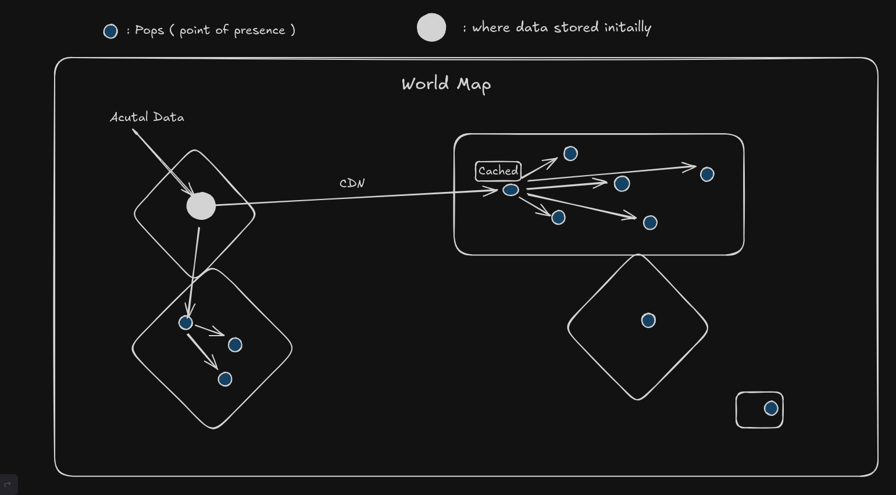

# Frontend Deployment via AWS : 

There is something called a ``Distribution`` and something call ``storage`` 

Some website want to distribute files ...like say ``youtube`` main game is ``videos`` .mp4 files or in whatever way they store the file . 

These video are not directly stored in the database itself . 

What does store in data are the name , title , description , veiws ,etc on the video 

## So were should you store them ?? 

In something call ``Object Store`` 

An object store is a way to store and manage data in units called objects. Each object typically contains the data itself, some metadata (information about the data), and a unique identifier. Unlike traditional file storage (where data is stored in files and folders) or block storage (where data is divided into fixed-sized blocks), object storage allows you to store large amounts of unstructured data (like documents, images, or videos) in a simple, scalable way.

Think of it like a giant digital warehouse where each item (object) is labeled with a unique code and stored without worrying about complex hierarchies or structures. This makes it ideal for cloud storage services. Examples include Amazon S3 and Google Cloud Storage.

``AWS - S3 (simple storage service)``

It is like a google drive to store the video , images , etc and generate a link ( example : s3.aws.com/datayoustored/mp4 ) 

## Is using this s3 link directly is a good practice ?

No 

You typically can't use S3 links directly due to several reasons:

1. Security and Access Control: By default, S3 buckets are private, meaning only authorized users or services can access the files. If you try to access an S3 object using a direct link without proper permissions, it will fail. AWS provides options like pre-signed URLs to temporarily grant access to private objects.

2. Access Speed: S3 is designed for storage rather than delivering files directly to end-users at high speeds. Using CloudFront (AWS's content delivery network) helps cache and distribute the content globally, improving performance for users.

3. URL Expiration: In some cases, the default S3 URL may not expire, potentially leading to security risks. Pre-signed URLs, on the other hand, expire after a set time, reducing exposure.

4. Cost: Direct access to S3 may increase costs because it lacks the optimizations (like caching) that a CDN like CloudFront provides, potentially leading to more frequent requests directly to S3.

5. Complex URLs: S3 object URLs can be long and complex, not ideal for use in applications or public sharing without using shortened links or CloudFront distributions.

## The Solution is --> CDN ( content delivery network )

A Content Delivery Network (CDN) is a network of servers distributed across various geographical locations to deliver web content faster and more efficiently to users. Is using this s3 link directly is a good practice 

``` note that you can't do is for backends ``` 

