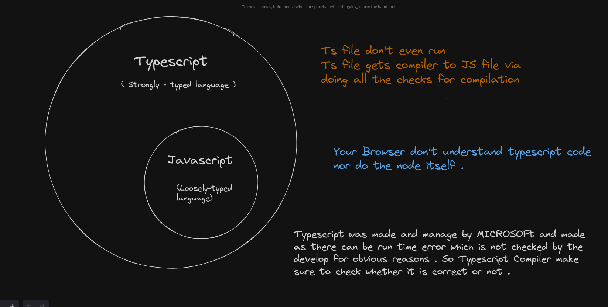

## Standard Ways : 

All ts files in a folder named : src 
All js files in a folder named : dist or built

### how to do it ?

In the tsconfig.json file :  

make : "rootDir" : "./src"
       "outDir"  : "./dist"

Ideally we will only push the rootDir (src folder) to github and put the dist folder in .gitignore        

## Enum : 

: Basic it makes your code cleaner and makes more sense 
: It never even reaches to the javascript compiled file
: Enums (short for enumerations) in TypeScript are a feature that allows you to define a set of named constants.
: The concept behind an enumeration is to create a human-readable way to represent a set of constant values, which might otherwise be represented as numbers or strings.